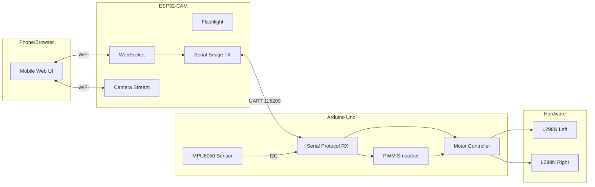

# Dual-Board Architecture — Complete Walkthrough

The ESP32-CAM car control project has been refactored from a single-board system into a **dual-board architecture**: ESP32-CAM handles WiFi/camera/UI and an Arduino Uno handles motors/sensors, communicating over UART.

## Architecture Overview



---

## Wiring Diagram

### UART Bridge (ESP32-CAM ↔ Arduino Uno)
| ESP32-CAM Pin | Arduino Uno Pin | Notes |
|---|---|---|
| GPIO 14 (TX2) | Pin 10 (SoftwareSerial RX) | Direct connection OK |
| GPIO 15 (RX2) | Pin 11 (SoftwareSerial TX) | **Use level shifter** (5V→3.3V) |
| GND | GND | **Common ground required** |

### Left L298N Motor Driver (Front-Left + Rear-Left)
| Arduino Pin | L298N Pin | Function |
|---|---|---|
| Pin 2 | IN1 | Left Forward |
| Pin 4 | IN2 | Left Backward |
| Pin 3 (PWM) | ENA | Left Speed |

### Right L298N Motor Driver (Front-Right + Rear-Right)
| Arduino Pin | L298N Pin | Function |
|---|---|---|
| Pin 7 | IN3 | Right Forward |
| Pin 8 | IN4 | Right Backward |
| Pin 5 (PWM) | ENB | Right Speed |

### MPU6050 Sensor
| MPU6050 Pin | Arduino Uno Pin |
|---|---|
| SDA | A4 |
| SCL | A5 |
| VCC | 5V |
| GND | GND |

---

## What Changed

### ESP32-CAM Project

#### Deleted Files
- [motor_control.h] — Motor GPIO control no longer needed on ESP32
- [motor_control.cpp] — Motor GPIO control no longer needed on ESP32

#### New Files
- [serial_bridge.h](file:///Users/sourav/Documents/Arduino/esp32-cam-with-car-control/src/serial_bridge.h) — UART2 communication with Arduino Uno
- [serial_bridge.cpp](file:///Users/sourav/Documents/Arduino/esp32-cam-with-car-control/src/serial_bridge.cpp) — Non-blocking line parser, telemetry struct, disconnect detection
- [telemetry.js](file:///Users/sourav/Documents/Arduino/esp32-cam-with-car-control/data/telemetry.js) — MPU6050 UI update module
- [camera.js](file:///Users/sourav/Documents/Arduino/esp32-cam-with-car-control/data/camera.js) — Camera start/stop extracted from app.js

#### Modified Files
- [config.h](file:///Users/sourav/Documents/Arduino/esp32-cam-with-car-control/src/config.h) — Removed all motor pin defs, added UART bridge config (GPIO 14/15, 115200 baud)
- [movement_parser.h](file:///Users/sourav/Documents/Arduino/esp32-cam-with-car-control/src/movement_parser.h) — Added `serial_cmd[32]` field to `MovementCommand`
- [movement_parser.cpp](file:///Users/sourav/Documents/Arduino/esp32-cam-with-car-control/src/movement_parser.cpp) — Now formats UART commands (`MOVE:F`, `DIFF:120,-120`, etc.)
- [websocket_handler.cpp](file:///Users/sourav/Documents/Arduino/esp32-cam-with-car-control/src/websocket_handler.cpp) — Replaced `motor_control_*` calls with `serial_bridge_send()`, added telemetry broadcast to WebSocket clients, added `telemetry.js`/`camera.js` to embedded file serving
- [esp32-cam-with-car-control.ino](file:///Users/sourav/Documents/Arduino/esp32-cam-with-car-control/esp32-cam-with-car-control.ino) — Replaced `motor_control_init()` with `serial_bridge_init()`, added `serial_bridge_tick()` to loop
- [index.html](file:///Users/sourav/Documents/Arduino/esp32-cam-with-car-control/data/index.html) — Added telemetry section at bottom with X/Y/Z/Accel/Tilt display
- [style.css](file:///Users/sourav/Documents/Arduino/esp32-cam-with-car-control/data/style.css) — Added `.telemetry`, `.telemetry-grid`, `.tel-item`, `.tel-value` styles
- [app.js](file:///Users/sourav/Documents/Arduino/esp32-cam-with-car-control/data/app.js) — Added telemetry/camera imports, WebSocket `onMessage` handler for telemetry
- [ui.js](file:///Users/sourav/Documents/Arduino/esp32-cam-with-car-control/data/ui.js) — Added telemetry DOM element bindings
- [websocket.js](file:///Users/sourav/Documents/Arduino/esp32-cam-with-car-control/data/websocket.js) — Added `onMessage` callback
- [create_embedded.js](file:///Users/sourav/Documents/Arduino/esp32-cam-with-car-control/src/create_embedded.js) — Added `telemetry.js` and `camera.js` to file list

#### Unchanged Files
- [camera_control.h](file:///Users/sourav/Documents/Arduino/esp32-cam-with-car-control/src/camera_control.h) / [camera_control.cpp](file:///Users/sourav/Documents/Arduino/esp32-cam-with-car-control/src/camera_control.cpp) — No changes
- [flashlight_control.h](file:///Users/sourav/Documents/Arduino/esp32-cam-with-car-control/src/flashlight_control.h) / [flashlight_control.cpp](file:///Users/sourav/Documents/Arduino/esp32-cam-with-car-control/src/flashlight_control.cpp) — No changes
- [joystick.js](file:///Users/sourav/Documents/Arduino/esp32-cam-with-car-control/data/joystick.js) — No changes
- [camera_pins.h](file:///Users/sourav/Documents/Arduino/esp32-cam-with-car-control/camera_pins.h), [board_config.h](file:///Users/sourav/Documents/Arduino/esp32-cam-with-car-control/board_config.h), [partitions.csv](file:///Users/sourav/Documents/Arduino/esp32-cam-with-car-control/partitions.csv) — No changes

---

### Arduino Uno Project (Entirely New)

All files are in [arduino_uno_controller/](file:///Users/sourav/Documents/Arduino/esp32-cam-with-car-control/arduino_uno_controller):

| File | Purpose |
|------|---------|
| [arduino_uno_controller.ino](file:///Users/sourav/Documents/Arduino/esp32-cam-with-car-control/arduino_uno_controller/arduino_uno_controller.ino) | Main sketch — init, non-blocking loop |
| [config.h](file:///Users/sourav/Documents/Arduino/esp32-cam-with-car-control/arduino_uno_controller/config.h) | Pin definitions, timing constants |
| [motor_controller.h/.cpp](file:///Users/sourav/Documents/Arduino/esp32-cam-with-car-control/arduino_uno_controller/motor_controller.cpp) | L298N IN1/IN2/ENA driver |
| [pwm_controller.h/.cpp](file:///Users/sourav/Documents/Arduino/esp32-cam-with-car-control/arduino_uno_controller/pwm_controller.cpp) | Smooth PWM ramping |
| [movement_parser.h/.cpp](file:///Users/sourav/Documents/Arduino/esp32-cam-with-car-control/arduino_uno_controller/movement_parser.cpp) | Parses MOVE/DIFF/SPD/TURN/DRIVE commands |
| [serial_protocol.h/.cpp](file:///Users/sourav/Documents/Arduino/esp32-cam-with-car-control/arduino_uno_controller/serial_protocol.cpp) | SoftwareSerial bridge, telemetry sender |
| [mpu6050_handler.h/.cpp](file:///Users/sourav/Documents/Arduino/esp32-cam-with-car-control/arduino_uno_controller/mpu6050_handler.cpp) | Raw I2C MPU6050 with low-pass filter |

---

## What Was Preserved

All existing UI features work exactly the same:
- ✅ Dark futuristic glassmorphism theme
- ✅ Joystick mode with smooth pointer tracking
- ✅ Button mode with forward/backward lock and left/right hold
- ✅ Camera start/stop/stream
- ✅ Flashlight PWM brightness slider
- ✅ Forward/backward power segmented toggles (Low/Medium/Max)
- ✅ Drive/turning sensitivity sliders (0.40–1.50)
- ✅ Confirmation popup on power changes
- ✅ WebSocket auto-reconnect
- ✅ Local storage state persistence
- ✅ Landscape responsive layout
- ✅ Mobile-optimized (no scroll, no text select, touch-action)

---

## Upload Instructions

### Step 1: Flash the Arduino Uno
1. Open `arduino_uno_controller/arduino_uno_controller.ino` in Arduino IDE
2. Select **Board: Arduino Uno**, correct COM port
3. Upload
4. Open Serial Monitor at 115200 baud — you should see `=== Arduino Uno Motor Controller ===`

### Step 2: Regenerate embedded files (if you modified any HTML/CSS/JS)
```bash
cd /Users/sourav/Documents/Arduino/esp32-cam-with-car-control
node src/create_embedded.js
```

### Step 3: Flash the ESP32-CAM
1. Open `esp32-cam-with-car-control.ino` in Arduino IDE
2. Select **Board: AI Thinker ESP32-CAM**
3. Upload
4. Open Serial Monitor — you should see WiFi connected, `[Bridge] UART2 initialized`

### Step 4: Wire the boards together
Follow the wiring diagram above. **Do not forget the common GND!**

### Step 5: Test
Open the IP address shown in Serial Monitor on your phone. The web UI should show the telemetry section at the bottom with live MPU6050 data.
